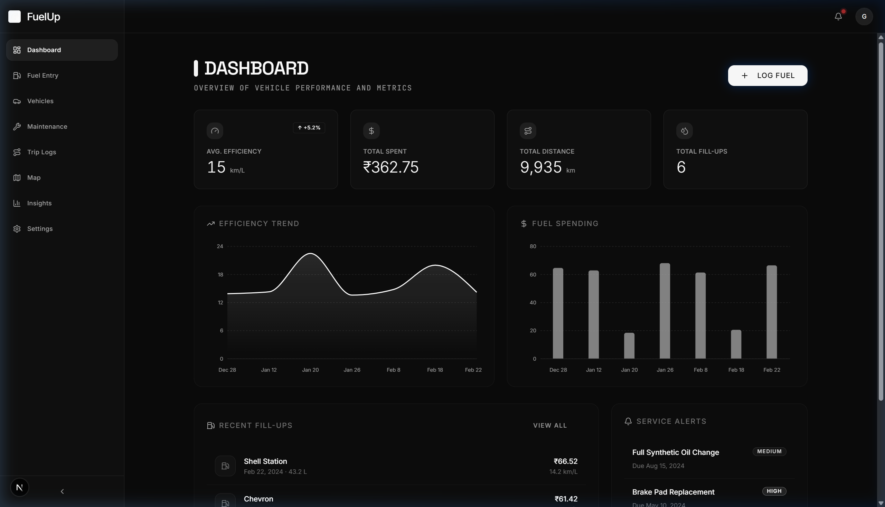
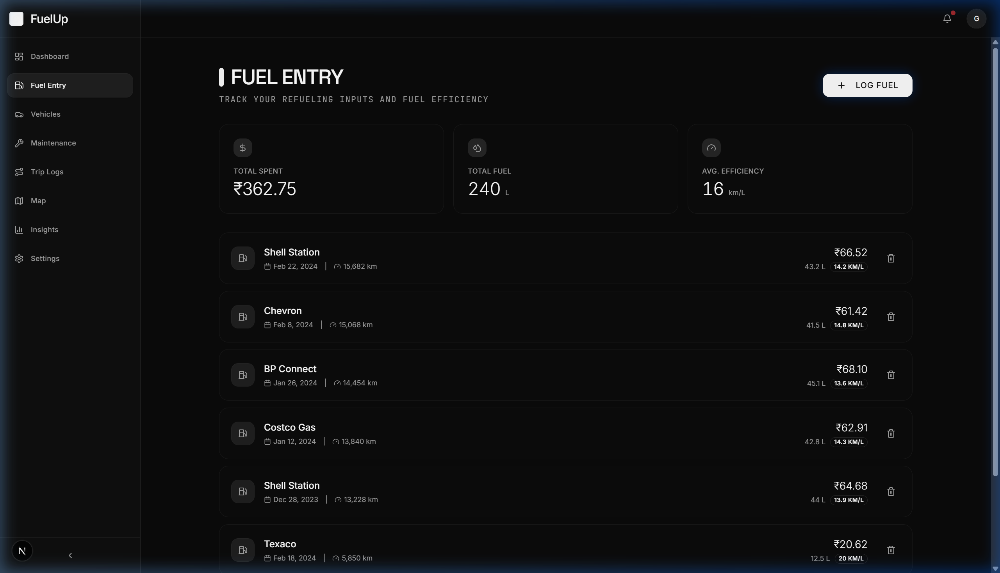
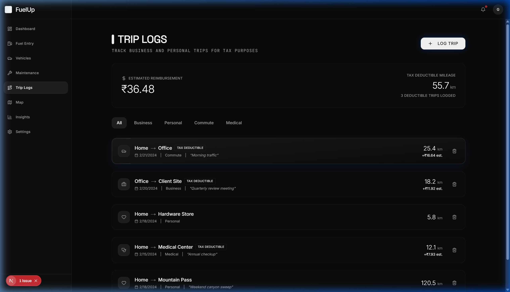
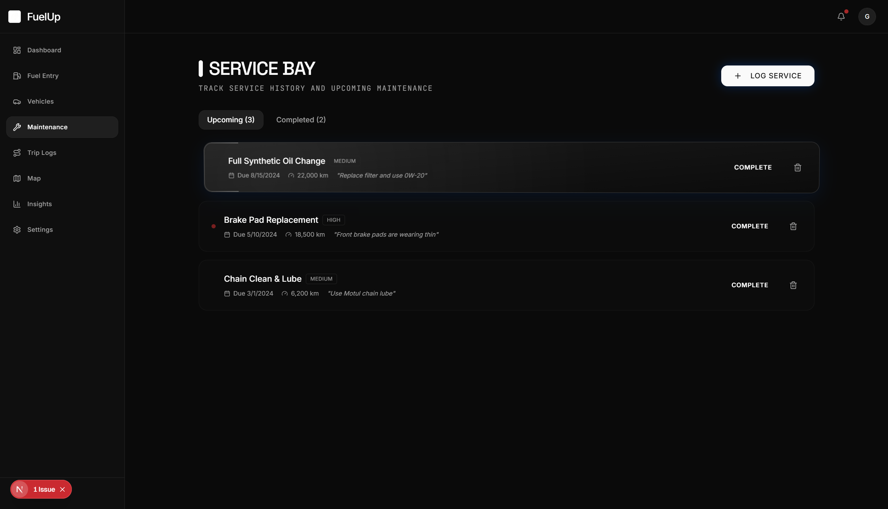
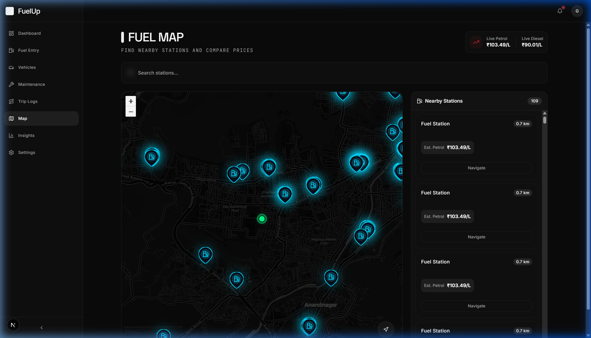

# FuelUp ⛽🚗

FuelUp is a modern, privacy-focused Next.js application designed to track fuel consumption, vehicle maintenance, and travel trips—all seamlessly managed within an elegant and sleek user interface. Built with a "premium glassmorphism" aesthetic (Memoria Design System) and relying entirely on local storage for ultra-fast, offline-first performance.



## ✨ Key Features

- **Vehicle Management:** Easily add and manage multiple vehicles (cars, motorcycles, scooters, SUVs, trucks, and vans).
- **Fuel Tracking:** Log fill-ups, track fuel costs, and monitor your average fuel efficiency over time.
- **Service Bay (Maintenance):** Keep track of upcoming maintenance schedules, organize completed service records, and never miss an oil change.
- **Trip Logging (Tax & Reimbursement):** Log your business, personal, medical, and commute trips. Instantly calculate estimated reimbursements and tax-deductible mileage.
- **Station Map:** Find nearby fuel stations using an integrated local map view powered by Leaflet. 
- **Offline-First Storage:** Fast, private, and secure. Data is stored locally on your device via Zustand's state persistence.
- **Beautiful UI:** Polished user interface featuring modern animations, `GlassCard` layouts, customized themes, and floating action buttons for quick data entry.

## 🚀 Getting Started

### Prerequisites

Ensure you have [Node.js](https://nodejs.org/) (version 18+ recommended) installed on your system. 

### Installation

1. **Clone the repository:**
   ```bash
   git clone https://github.com/prathameshfuke/fuelup.git
   cd fuelup
   ```

2. **Install dependencies:**
   ```bash
   npm install
   # or
   yarn install
   # or
   pnpm install
   ```

3. **Start the development server:**
   ```bash
   npm run dev
   # or
   yarn dev
   # or
   pnpm dev
   ```

4. **Open the app:**
   Open [http://localhost:3000](http://localhost:3000) in your browser to view the application.

## 📸 Screenshots

Here are a few glimpses of FuelUp's interface:

| Dashboard | Fuel Logging |
|:---:|:---:|
|  |  |

| Trip Tracking | Maintenance Log |
|:---:|:---:|
|  |  |

| Station Map |
|:---:|
|  |

## 🛠️ Tech Stack & Architecture

- **Framework:** [Next.js 14](https://nextjs.org/) (App Router)
- **UI & Styling:** [Tailwind CSS](https://tailwindcss.com/), [Framer Motion](https://www.framer.com/motion/), [shadcn/ui](https://ui.shadcn.com/)
- **State Management:** [Zustand](https://github.com/pmndrs/zustand) (with `persist` middleware for LocalStorage)
- **Map:** [React Leaflet](https://react-leaflet.js.org/)
- **Icons:** [Lucide React](https://lucide.dev/)

## 🎨 Design System (Memoria)

FuelUp uses a custom "Memoria" design scheme which emphasizes:
- **Monochromatic Accents:** Clean, sophisticated single-color themes (like Ocean Blue, Forest Green).
- **Glassmorphism:** Transluecent backgrounds with border glows (`BorderBeam`) and blurs (`BlurReveal`).
- **Dynamic Interactions:** Staggered entrance animations, hover micro-interactions, and visual feedback toasts.

## 🤝 Contributing

Feedback and contributions are welcome! Feel free to open issues or submit pull requests.

## 📄 License

This project is licensed under the MIT License.
